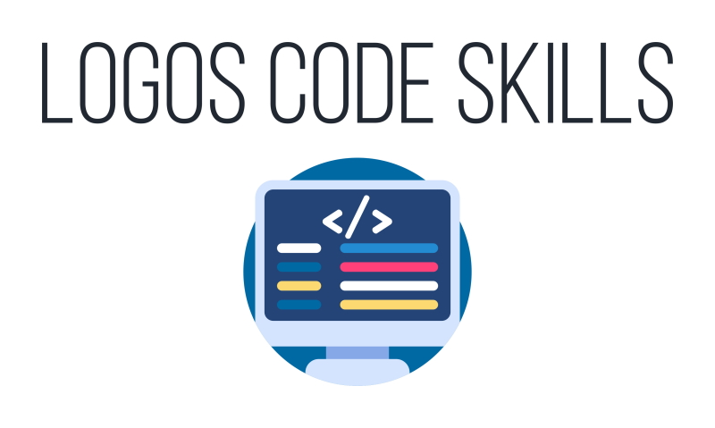

<meta property="og:image" content="https://raw.githubusercontent.com/sebastien-d-me/logos-code-skills/main/Logo.jpg">

# Logos Code Skills - Sébastien D


## 📖 Description
Get custom logos for your software development skills.


## 🌐 Website
Consult the site for more details [here](https://sebastien-d-me.github.io/logos-code-skills).


## 📜Installation
```cmd
npm i react-logos-code-skills
```


## ⚙️ Use
1. Import the plugin in your project like this : 
```javascript
import Skill from "react-logos-code-skills";
```

2. In the return : 
```javascript
<Skill name={`EXAMPLE`} parameter={skillParameter} />
```
Some logos are already provided like HTML, CSS, JS and more, please check the site !
For example change EXAMPLE to HTML.


## 🎨 Personalize
1. Put this into your file :
```javascript
const skillParameter = {
	"backgroundColor": "#000000",
	"borderRadius": 15,
	"color": "#FFFFFF",
	"height": "80px",
	"width": "80px"
}
```
Go [here](https://sebastien-d-me.github.io/logos-code-skills/) to see more about customization.


## 📝 License
MIT © [sebastien-d-me](https://github.com/sebastien-d-me)
